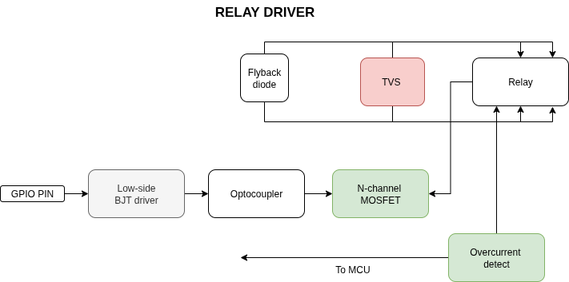
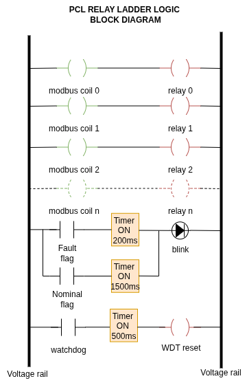
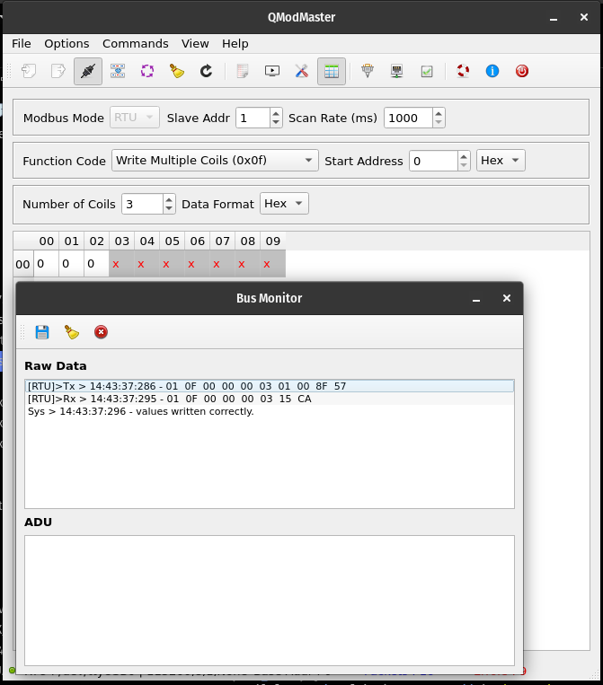
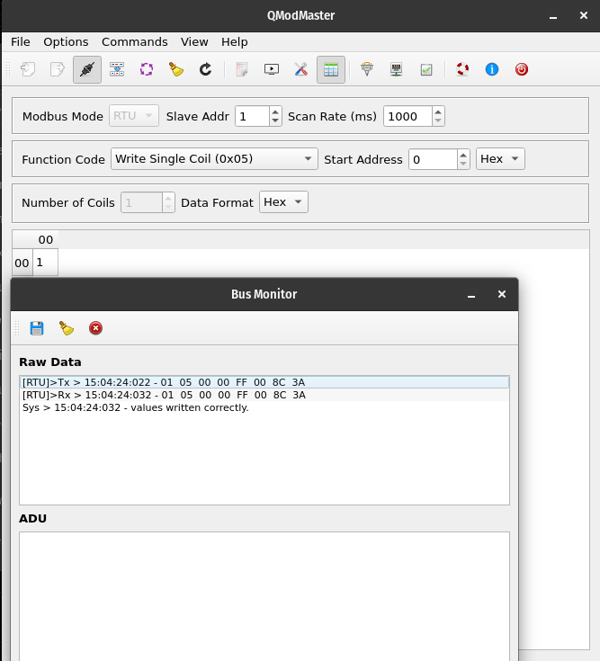
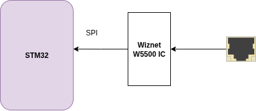
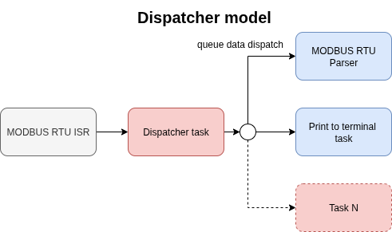
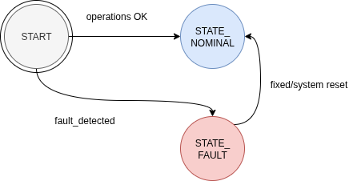

# Documentation


#### Details 
Prepared by: Edwin Mwiti  
Submission for: Control and Instrumentation Engineer - Intern

## Table of Contents 
1. Introduction 
2. Functional requirements 
3. Relay control 
4. Industry standard relay control interface and schematic
Relay power supply 
5. Relay control logical organization 
6. IO expander driver 
7. Relay driver interface 
8. Relay control abstraction levels
9. Scalability of the relay controls
10. Relay Testing and validation
11. ModBuS RTU
12. RS485 transceiver schematic
13. RS485 transceiver schematic Improvement
14. RS485 hardware driver API
15. Handling unknown ModBus data length
16. Compatibity with S7-1200
17. ModBus testing and validation with QModMaster
18. Ethernet Connectivity
19. TCP/IP control interface with ModBus TCP
20. Ethernet stack configuration
21. Concurrency management with FreeRTOS
22. Priority table and logic behind it
23. Interrupt vector Priority
24. Inter-task communication
25. Memory management strategy
26. Synchronization methods used
27. Feedback and diagnostics 
28. Fault detection mechanism 
29. Onboard fault state indicator
30. Testing and Validation plan
31. Stress Testing plan
32. Additional feature list
33. References and schemas


### Introduction
Based on the problem statement, this device is a slave device because it implements slave functions especially the MODBUS register read and write. i.e:
- Read coils
- Write single coil
- write multiple coils

Also, I figured that because it has relays, these relay are to be controlled by another device (MASTER device) via the MODBUS RTU. And this master device is the SIEMENS S7-1200.

Also this slave exposes its port/URL via ethernet. So data can be transferred, logged etc..

## Functional Requirements
# 1.Relay Control

## Industry standard relay control  hardware 
To meet the industry standard safety requirement, I made a heavy reference to IEC 60947 that defines control of high voltage switchgear (RCBs, Relays, contactors) etc. (Link in the references)

Although much of it is implemented when laying out the PCB (e.g creepage distances), here is a list of what I implemented in this relay control circuit: 
1. Isolation using optocouplers 
2. Flyback and surge suppression using flyback diodes, RC snubber and TVS clampers
5. Fault detection

This circuit is designed to be compatible with PLC-RSC-24DC/21 relay module that has the following features:
- Screw connection 
- DIN rail mount NS 35/7, 5, 1
- 1 changeover contact 
- Input voltage 24V
- Rated insulation voltage 250V
- MAX power disspation 
- Overvoltage category III


## Relay power supply 
To provide a stable and robust power supply scheme for the relay control (S7-1200), I'd recommend the following setup. 
- Using a dedicated 24V DC power supply. This must be an SMP to minimise conversion losses. Typical used power supply is a AC-24DC converter block. Or a DC-DC converter with sufficient current to drive the coil solenoid. 
- Next a robust driver IC/mechanism is recommended. For low losses , I'd use an N-channel mosfet (P channel would require high side driver which further complicates the circuit). A MOSFET can be used for each relay. 

Cost implications -> However if I use a single mosfet for each relay, cost might be high but factoring in ecnonimes of scale, we can acyually make it cheaper for more units. 

Alternatively, use  driver IC like the ULN2803. This can drive multiple relays and make the design a little bit more compact of we have a lot of relays to drive. 

- **Protection:**
- To meet standards, I would use a TVS diode to clamp surges on just next to relay solenoid. I have added one in the abive circuit. 
- Adding a flyback diode in parallel with the relay's coils will suck in back EMF during transient switching. 

- **Isolation:**
I used an optocoupler to provide isolation in my setup. This can be further improved by using voltage isolation ICs. However for this assignment, optocouplers will suffice. 

The block diagram below shows the relay side driving. 




### Relay logical organization
To organize 32 relays logically, and to remain simple, I used bit groups. Each relay bank is a uint8_t type, where each relay is represented by a single bit in that uint8_t type.

|Bank name| Type| Relays range |
|---|---|---|
|BANK_0|uint8_t | Relay 0-7 |
|BANK_1|uint8_t | Relay 8-15 |
|BANK_2|uint8_t | Relay 16-23 |
|BANK_3|uint8_t | Relay 24-31 |

These are defined in ```relay.h``` file. Since there are 32 relays to be controlled, I use an expander via i2c for this function.

#### IO Expander driver
The driver I use is the MCP23017. I choose it because it has 16 bit outputs whcih means I only need 2 expanders to handle 32 relays.
I wrote a basic driver for the needed fucntions of interfacing the RELAY to the STM32. Some of these fucntions are:

```c
void MCP_initialize(MCP23017_instance inst, I2C_HandleTypeDef* i2c_handle, uint8_t address);
void MCP_pinmode(MCP23017_instance inst, uint8_t pin, uint8_t mode);
void MCP_all_pinmode(MCP23017_instance inst, uint8_t state, uint8_t port);
void MCP_write_pin(MCP23017_instance inst, uint8_t pin, uint8_t level);
uint8_t MCP_read_pin(MCP23017_instance inst, uint8_t pin);
uint8_t MCP_read_port(MCP23017_instance inst, uint8_t port_num);
void MCP_clear_port(MCP23017_instance inst, uint8_t port_num);

```

#### Relay driver API
To meet hardware abstraction and code maintainability, all relay control functions are defined in their own header file,
```c relay.h```

I have written the API to achieve the required deliverables of setting, clearing and reading the state of each relay, using logical
orgnaization in banks.

The relay API functions are listed below:
```c

void relay_init();
void relay_set(uint8_t bank, uint8_t relay_num, uint8_t state);
boolean_t relay_read_state();
uint8_t relay_resolve_bank(uint8_t n);

uint8_t relay_read(uint8_t bank, uint8_t relay_num);
uint8_t relay_read_bank(uint8_t bank);

void relay_clear(uint8_t bank, uint8_t relay_num);
void relay_clear_bank(uint8_t bank);


```
The functions are pretty quite well documented on the files themselves.


#### Abstraction levels
To meet hardware abstraction, the MCP23017 is only visible through the relay driver APIs, since that is the only user. This diagram shows the abstraction:


#### Scalability of the relay controls
Now, because I used an I2C expander, the MCP23017 has 3 address bits(A0,A1, A2), so it can handle up to 8 devices on the same I2C peripheral. Those are 128 relays that can be added.
Scaling the Relay control class is as "simple" adding another MCP23017 IC and hardware-configuring the address.
On the software side, the driver remains the same, but if we add more relays we need to add more banks. SHould be trivial. Rather, this was my approach.

## Testing and validation
I have tested and validated this code/functions with actual hardware expander chip and STM32F401CCU6, the following tests have been carried out:
    - STM32F401CCU6 code compilation
    - MCP23017 Driver GPIO expansion


If, however, PLC ladder logic is needed and used, the following block diagram represents how I would wire the PLCs for relat control: 

### PLC ladder logic


# 2. MODBUS RTU

### RS485 transceiver schematic
To include RS485 transceiver hardware interface, I used MAX485 IC and designed its typical circuit. This can be used for both master and slave, difference being the termination. 

What is included in this circuit excerpt:
- MAX485 transceiver IC
- COmmon mode choke for high frequency noise 
- TVS for transient suppression 
- Low ohm series resistors for ringing/reflection suppression
- 120R Termination resistor ON/OFF control


#### RS485 transceiver schematic Improvement
Based on my experience, RS485 is a pretty robust standard and the tranceivers handle most of the noise/suppression for differential signals. However, for maximum reliability, the following can be added: 

- Add MOV for to line A and B just next to the connector so high V transients are caught fast. 
- Provide galvanic isolation between the MCU and the RX/TX/DI signals to properly isolate the MCU and other circuit components on this line.


### RS485 Driver
This section will describe how I designed for MODBUS RTU.
MODBUS consists of a slave and a master. The master sends requests to slave and the slave responds back with the requested data. The list below shows the function codes that can be used under MODBUS:

| Function Code | Hex Value | Description                          |
|---------------|-----------|--------------------------------------|
| 01            | 0x01      | Read Coils                           |
| 02            | 0x02      | Read Discrete Inputs                 |
| 03            | 0x03      | Read Holding Registers               |
| 04            | 0x04      | Read Input Registers                 |
| 05            | 0x05      | Write Single Coil                    |
| 06            | 0x06      | Write Single Register                |
| 08            | 0x08      | Diagnostics (Serial Line only)       |
| 11            | 0x0B      | Get Comm Event Counter (Serial Line only) |
| 15            | 0x0F      | Write Multiple Coils                 |
| 16            | 0x10      | Write Multiple Registers             |
| 17            | 0x11      | Report Server ID (Serial Line only)  |
| 22            | 0x16      | Mask Write Register                  |
| 23            | 0x17      | Read/Write Multiple Registers        |
| 43/14         | 0x2B/0x0E | Read Device Identification           |

The following is the generic structure of MODBUS RTU packet:

```c
[ Slave Address ][ Function Code ][ Data ][ CRC Low ][ CRC High ]

```

Therefore depending on the function code being implemented, the data section can vary.
I wrote a basic driver to handle MODBUS data reception. This STM32 driver was to implement most if not all of the above requirements for S7-1200.

It exposes the following interface:

 - MAX485 device init
 - End of transmission silent interval using UART IDLE LINE DETECTION
 - Correctly decodes MODBUS frame from master
    - Message length decoding
    - extraction of MODBUS function code
    - extraction of MODBUS data
    - CRC calculation
- Exception handling for MODBUS
- MODBUS timeout

#### Handling unknown ModBus data length
For efficiency due to handling a large data packet, I use UART with IDLE LINE DETECTION for data reception. This allows to detect the end of transmission burst (3.5 char SILENT Interval).

Now, from the MODBUS protocol, the maximum packet size fpr PDU is 255 bytes.
The actual data length is 252 bytes (- address - 2 bytes for CRC)

The data is routed via MAX485 transceiver to handle TTL to RS485 conversion. Then my driver handles this next part which is written to parse/decode the packet:

#### RS485 hardware driver API
This few functions handle RS485 connection to STM32. This functions are located in ```modbus_rtu.c``` file.

a) Driver initialization
I initialize MAX485 instance with the ```UART peripheral```, ```GPIO PORT ``` and the ```DE_RE pin```.

```c

typedef struct {
	UART_HandleTypeDef* uart_instance;
	GPIO_TypeDef* DE_RE_PORT;
	uint16_t DE_RE_pin;
} MAX485;

typedef MAX485* MAX485_instance;

```

b) Enable transmit
This function is used to set MAX485 for transmission mode

```c

/**
 * @brief This functions enables the transmit mode on MAX485 IC
 */
void MAX485_enable_transmit(MAX485_instance inst) {
	//write 1 on the DE pin
	HAL_GPIO_WritePin(inst->DE_RE_PORT, inst->DE_RE_pin, GPIO_PIN_SET);

}
```

c) Enable receive
This function is used to set MAX485 for receive mode

```c

void MAX485_enable_receive(MAX485_instance inst) {
	// write 1 on the RE pin
	HAL_GPIO_WritePin(inst->DE_RE_PORT, inst->DE_RE_pin, GPIO_PIN_RESET);
}
```

d) Calculate CRC
This function is used to calculate and confirm CRC from the received master request. (only in RTU mode)

Polynomial used is 0xA0001

```c
uint16_t MAX485_calculate_CRC(const uint8_t* buf, uint16_t len) {
	uint16_t crc = 0xFFFF;
	for(uint16_t pos = 0; pos < len; pos++) {
		crc ^= (uint16_t)buf[pos];

		for(int i = 0; i < 8; i++) {
			if(crc & 0x0001) crc = (crc>>1) ^ 0xA001;
			else crc >>= 1;
		}
	}

	return crc;
}

```


```c
[ Slave Addr ][ 0x01 ][ Start Addr Hi ][ Start Addr Lo ][ Quantity Hi ][ Quantity Lo ][ CRC Lo ][ CRC Hi ]

```

### ModBus operation
Coils are defined as single-bit values that represent the status of a input/output value. They are boolean variables. For integration with relay control, since the relays are arranged in BANKS, a single BANK May be considered a coil byte, with each bit representing the status of a relay.

The master sends request to the slave which then interprets the request to determine which operation it should perfom (read coils, etc)
The slave performs the requested function and then responds back to the master with the requested data and/or response.

## Compatibility with S7-1200
The S7 is going to be the master device that pulls data from MODBUS server(slave device), in this case my device is the slave device. To maintain compatibility, I made sure this device achieves the following list:
- Serial setings (BAUD:115200, 8-N-1)
- Uses standard MODBUS RTU framing
- confirms the 3.5 char SILENT INTERVAL
- Responds correctly to function codes
- Handle MODBUS exceptions correctly
- Handle slave IDs correctly
- RE/DE correct control
- CRC-16 computing

## ModBus Testing and Validation with QModMaster
Using the hardware I had namely:
- MAX485 modules
- STM32F401CCU6

I could transmit from one STM32 (MASTER ) to the slave device. 

However, to test real MODBUS RTU packets, I used QmodMaster simulator on my PC to simulate the master packets. The following screenshots show that master commands are being identified.

The following is the setup I used:


### Read coils (0x01)
---

I used a simulated coil byte array that looks like this:

```c
/* example coils byte array for testing - each bit holds a coil - grouped into bytes of coils */
uint8_t coils[(COIL_COUNT + 7) / 8] = {0x4D, 0x0D};
```
I will try read from the first byte (0x4D) (0b01001101) to validate my code. 
This is the request sent from the master: 

#### Request (from Master)
| Field        | Value (Hex) | Description                     |
|--------------|-------------|---------------------------------|
| Slave ID     | `01`        | Address of slave device         |
| Function     | `01`        | Read Coils                      |
| Start Addr Hi| `00`        | High byte of start address      |
| Start Addr Lo| `00`        | Low byte of start address       |
| Qty Hi       | `00`        | High byte of quantity           |
| Qty Lo       | `03`        | Read 3 coils                    |
| CRC Lo       | `??`        | CRC16 low byte (calculated)     |
| CRC Hi       | `??`        | CRC16 high byte (calculated)    |

#### Expected response 
Since my coils bits are 0b0100 1101, and first coil is LSB, I expect to return 0b0000 0101 (0x05) as the value of my coils. This is the expected response: 

#### Response (from Slave, coils = `0x4D`)
| Field        | Value (Hex) | Description                          |
|--------------|-------------|--------------------------------------|
| Slave ID     | `01`        | Same as request                      |
| Function     | `01`        | Read Coils                           |
| Byte Count   | `01`        | 1 byte of coil data follows          |
| Coil Status  | `05`        | `0b00000101` → coils 0=1, 1=0, 2=1    |
| CRC Lo       | `??`        | CRC16 low byte (calculated)          |
| CRC Hi       | `??`        | CRC16 high byte (calculated)         |

I did this using the simulator and this is the response

 

This validates my read coils function as required.


##### Write multiple coils (0x0F)
Writing to multiple coils simultaneously forces a series of coils either ON or OFF. it specifies the starting coil address to be forced, the number of coils and the force data to be written in ascending order. A logic 1 forces coil ON and 0 forces coil OFF.

This was my test packet and response using QModMaster:

| Field            | Value | Description |
|------------------|-------|-------------|
| Slave Address    | 01    | Target slave device |
| Function Code    | 0F    | Write Multiple Coils |
| Start Addr Hi    | 00    | High byte of start address |
| Start Addr Lo    | 00    | Low byte of start address (coil #0) |
| Quantity Hi      | 00    | High byte of number of coils |
| Quantity Lo      | 03    | Write 3 coils |
| Byte Count       | 01    | 1 data byte follows |
| Coil Values      | 05    | 00000101 → Coil0=ON, Coil1=OFF, Coil2=ON |
| CRC Lo           | XX    | CRC (low byte) |
| CRC Hi           | XX    | CRC (high byte) |


---
 

As seen, the values were read and updated correctly. This validates my write multiple coils function.


##### Write single coil
This is the request I sent to the slave: 

###### Write Single Coil Request (Turn ON Coil 0x0000)

| Field          | Value | Description |
|----------------|-------|-------------|
| Slave Address  | 01    | Target slave device |
| Function Code  | 05    | Write Single Coil |
| Coil Address Hi| 00    | High byte of coil address |
| Coil Address Lo| 00    | Low byte of coil address (coil #0) |
| Value Hi       | FF    | `FF00` = ON |
| Value Lo       | 00    | — |
| CRC Lo         | 8C    | CRC (low byte) |
| CRC Hi         | 3A    | CRC (high byte) |


---
 

The expected response should be same as the request sent from master. And this can be seen in the above simulation. This validates my write single coil function. 


## Code decription
#### Read coils

I had a dummy coil data as shown here, (ideally these should be set and reset with relays):

```c
uint8_t coils[(COIL_COUNT + 7) / 8] = {0x4D, 0x0D};
```


The function below show the read coil function. Much of it follows MODBUS RTU manual, and I have documented as much as I can: 

```c


/**
 * @brief This function handles MODBUS function codes, whether they are from RTU or TCP
 */
uint16_t MODBUS_handle_function(uint8_t slave_id, uint8_t function_code, uint8_t* modbus_data, uint8_t* response, uint8_t src) {

	/*todo: check for null pointer */
	if(response != NULL) {

		/* to hold the length of the computed response. This is dynamic based on the function code */
		uint16_t response_length = 0;

		switch (function_code) {
			case READ_COIL:

				/* for debug */
				//HAL_UART_Transmit(&huart1, (uint8_t*) "READ COILS\r\n", strlen("READ COILS \r\n"), HAL_MAX_DELAY);

				/* coil to start from */
				uint16_t start = (modbus_data[2] << 8) | (modbus_data[3]);

				/* how many coils to read */
				uint16_t qty = (modbus_data[4] << 8) | (modbus_data[5]);

				/* todo: check valid coils - build exception */
				response[0] = slave_id;
				response[1] = 0x01;

				uint16_t index = 3;
				uint8_t coil_byte = 0;
				uint8_t bit_pos = 0;

				for(uint16_t i = 0; i < qty; i++) {
					/* get the actual coil value - bit extraction*/
					/* this is using a simulated coils buffer that have prefixed coil status - ideally it should be dynamic from the relays */
					uint8_t coil_val = (coils[(start + i) / 8] >>  ( (start + i) %8) ) & 0x01;

					/* if coil is set, set coil byte value */
					if(coil_val) {
						coil_byte |= (1 << bit_pos);
					}

					/* next bit position */
					bit_pos++;

					/* we have reached end of byte. reset to next byte */
					if(bit_pos == 8 || i == qty - 1) {
						response[index++] = coil_byte;
						coil_byte = 0;
						bit_pos = 0;
					}

				}

				/* we have the number of bytes we produced */
				response[2] = index - 3;

				/* append CRC for RTU messages */
				if(src == MODBUS_RTU) {
					uint16_t crc = MAX485_calculate_CRC(response, index);

					/* get CRC LOW */
					response[index++] = crc & 0xFF;

					/* get CRC HIGH */
					response[index++] = (crc >> 8) & 0xFF;

					response_length = index;

				} else {
					/* modbus TCP */
				}


				break;


                /// THE REST OF THE CODE 

```


To make this documentation shorter, the other functions also follow the same structure and can be found in the ```modbus.c``` file.

# Ethernet Connectivity
The purpose of ethernet in this slave is to allow the slave device to communicate over an network using MODBUS TCP. This allows the MODBUS slave to be part of a local area network. 

MODBUS TCP wraps the MODBUS protocol in TCP/IP packets. The slave device listens on a TCP port( typically 502) and responds to requests from a MODBUS TCP master. 

Ethernet is majorly part of data link layer but also the physical layer in the OSI Model that carries these TCP/IP packets.

## Ethernet stack configuration
Two components are of importance here: 
- MAC layer (Media access controller)
- PHY layer

MAC handles the data link layer such as framing, addressing and managing ethernet packets.

PHY is an external chip connected to STM32 via RMII or MII interface. I used the popular W5500 PHY chip for this project. It manages the actual electrical signaling, speed negotiation and link detection with the ethernet cable.

MAC and PHY form the complete ethernet interface. Since the MAC is inside the STM32, STM32 is responsible for setting up the MAC interface and configuring pins while PHY handles the physical connectivity to the network. 

The block diagram below explains this part:


Since the slave device exposes a direct Ethernet connection, it can be directly connected to a Network switch then routed to diagnostics tool etc. 

Additionally, a MODBUS-RTU to MODBUS-ETHERNET converter can be used to mate ModBus RTU packets to ModBus TCP packets for use in the diagnostics tool.

## Ethernet connectivity on STM32
Since STM32F401CCU6 does not have internal MAC, I inted to use the popular W5500 IC from WizNet that integrates ethernet: It has the following features: 

- BUilt in TCP/IP
- Communicates over SPI interface 
- Supports 10/100 Mbps
- 32KB internal memory 
- can use both foxed length data mode and variable length data mode (allowing other devices to use the same SPI bus)
- Has a library from manufacture to handle sockets

And since this IC has intena TCP/IP, a lot of firmware work is offloaded from the MCU, saving memory and perfomance.  
All I have to do is read and write fucntions to ethernet via SPI HAL drivers.




### Ethernet schematic excerpt 
To increase reliabilty on the ETHERNET port, I used an RJ45 connector with integrated magnetics. This does not include impedance matching as an external circuit. THey are designed to provide correct impedance (100 R differential), for ethernet, as well as suppress common mode noise.

The circuit below shows my circuit excerpt for Ethernet Functionality:


W5500 chip will be an SPI slave to the MCU controller. 


### Ping Test 
[todo]

## TCP/IP control interface with ModBus TCP
The only difference between ModBus RTU and ModBus TCP is that ModBus TCP embeds the standard ModBus frame packet into a TCP frame that looks like the one below: 


My approach to implement the interface to handle ModBus TCP is as follows: 
1. Receive ModBus packet via ethernet on port 502
2. Trigger the tcp_receive_callback().
3. pass payload to ```x_task_modbus_receive_TCP```
4. process request -> extract function code length etc...
5. build a reply
6. send back reply via ```modbus_TCP_send_response()```

Here is a code snippet for ModBus TCP function:

```c

void x_task_receive_modbus_TCP(void const* arguments) {
	Modbus_tcp_type_t modbus_tcp_pkt;
	uint8_t modbus_tcp_response[MODBUS_TCP_MAX_SIZE];
	uint16_t response_len = 0;

	for(;;) {
		/* peek from ModBus TCP queue */
		if(xQueuePeek(modbus_TCP_queue_handle, &modbus_tcp_pkt, portMAX_DELAY) == pdPASS) { // todo: remove MAX delay

			if(modbus_tcp_pkt.len < 8) {  /* MBAP header(7 bytes) + function(1 byte) is 8 bytes todo: get this length from the function receiving the TCP packet */
				continue;				/* ignore and jump to the next iteration of the loop */
			}

			uint16_t transaction_id = (modbus_tcp_pkt.data[0] << 8) | (modbus_tcp_pkt.data[1]); ///< MBAP valyes
			uint16_t protocol_id = (modbus_tcp_pkt.data[2] << 8) | (modbus_tcp_pkt.data[3]);
			uint16_t length_id = (modbus_tcp_pkt.data[4] << 8) | (modbus_tcp_pkt.data[5]);
			uint8_t unit_id = modbus_tcp_pkt.data[6];  // slave ID

			uint8_t function_code = modbus_tcp_pkt.data[7];		///< Protocol Data Unit (PDU)
			uint8_t* modbus_data = &modbus_tcp_pkt.data[8];

			// get the length of the PDU
			uint16_t pdu_len = modbus_tcp_pkt.len - 7; // MBAP is 7 bytes

			// check and operate on the function code
			// this is the length of the PDU only
			//response_len = modbus_tcp_handle(function_code, pdu_data, pdu_length, response);

			// build back the header (7 bytes)
			modbus_tcp_response[0] = transaction_id >> 8; // hi byte
			modbus_tcp_response[1] = transaction_id  & 0xFF; // lo byte
			modbus_tcp_response[2] = 0x00;					// protocol ID is 0 always
			modbus_tcp_response[3] = 0x00;
			modbus_tcp_response[4] = (response_len + 1) >> 8;
			modbus_tcp_response[5] = (response_len + 1) & 0xFF;
			modbus_tcp_response[6] = unit_id; // slave ID

			// get the total length of the packet including MBAP header
			uint16_t total_length = response_len + 7;

			// todo: send back this response to master
			//modbus_tcp_send_response();

			// send response via ModBus TCP
		} else {
			// todo: error/debug
		}

		// update event bit
		//xEventGroupSetBits(modbus_TCP_event_group_handle, )
	}
}


```

# Concurrency management with FreeRTOS
For concurrence management, the following tasks were defined at a minimum:
    - relay control task
    - MODBUS RTU task
    - Ethernet communication task
    - System monitoring task

## Task 1: System monitoring task( x_device_get_diagnostics task)
This task is used to collect general board/device data, and monitor the system parameters.

The data that I collect is:
    - chip ID
    - Die temperature
    - core clock frequency
    - Internal supply voltages
    - Reference voltage (I read this incase ADC is used directly without external ADC converters that use I2C where internal ADC ref voltage does not matter much)
    - free heap size
    - minimum ever free heap size since started running
    - number of running tasks
    - TCB (task control block) size for each task
    - Reset cause (watchdog, software reset, brownout reset)

The inbuilt chip parameters can be enabled or disabled by setting the ```GET_INTERNAL_PARAMETERS``` to 0 in the ```custom_config.h``` file.

## Task 3: Ethernet communication task 

## Task 4: System monitoring task

### Priority table and logic behind it

The biggest factor that affected my priority table was how critical the task  is going to be. Because I am using ISR to receive MODBUS RTU on uart, I need the queueus receiving this data to be as fast as possible to prevent blocking: 

x_task_modbus_dispatcher: I set this as priority high  (osPriorityHigh)
because it is the first consumer of the ISR data frame. It should quickly dispatch the data to consumers so that queues dont throttle. Making it high priority so that it runs immediately after ISR fires. 

x_task_receive_modbus_RTU: osPriorityAboveNormal  
because this is the task that forms RTU responses and triggers actions. It must be fast and should not block the dispatcher from distributing new frames

x_task_relay_control: osPriorityAboveNormal  
this is critical for control. So having its priority above normal makes sure the actuation happens promptly, the priority for this must remain lower than the parser, because the parser decides which relays to activate

x_task_print_to_terminal: osPriorityLow  
This is a non-critical task 

x_task_receive_modbus_TCP:  osPriorityBelowNormal  
Depending on our use case, MODBUS RTU can be choosen to be the higher method. In this case, modbus TCP will not be very time critical. So I give it lower priority to make sure RTU traffic wins over resource contention

x_task_get_device_diagnostics: osPriorityLow  
in this case diagnotics is a background task. so low priority makes sense

### Inter-task communication
To handle inter-task communication, I mainly used shared queues. For instance for diagnostics task, I created a queue with 10 items that hold a diagnostics data type as shown below: 

This queue is used in the following two tasks:
1. Debug to terminal task
2. Send via ethernet task. 

### Synchronization methods used 
One of the typical problems when using shared queues for intertask communication is that you must manage the producers and consumers effectively, otherwise the consuming tasks will see different data points which is not desired. This is due to the fact that when you receive data on a consumer task using ``` xQueueReceive()```, that data point is removed from the queue, so if there is another task receiving this same data, it will receive the next data point, which is a problem.

So I used Event Groups to syncronize the data passing. Event groups allow me to wait until all the tasks have received the data, then I can effectively remove the data from the queue.  

I defined this event group as follows: 
```c
EventGroupHandle_t modbus_event_group_handle;
```
Now, I figured how many producers and consumers I have for my modbus data. This block diagram shows this: 


Then I define a bit mask for each consumer task 

```c
// ============ EVENT GROUPS =================
#define RECEIVE_MODBUS_BIT		(1 << 0UL)		// bit set if MODBUS RTU received from MODBUS_RTU queue
#define PRINT_TO_TERMINAL_BIT	(1 << 1UL)		// bit set if Print to terminal task received from MODBUS_RTU queque
```

Each task is responsible for only peeking into the queue, without removing data from the queue. After this, is sets the corresponding event bit to notify the event group that it has finished using the data. 

The task named ```x_task_clean_modbus_RTU_queue``` sits waiting for all the consumer tasks that depend on ModBus RTU data to finish receiving the data. After checking all bits are set, it can then effectivley remove this data from queue. 
By doing this, I am able to basically sync producing tasks and consuming tasks.

However, this works for low traffic, and there is tight coupling between clean_up tasks and the consumer tasks, so it is bound to fail at some point. 

This led me to use the dispatcher model of task/queue synchronization: 

### Queue dispatcher model
This is a simple model that basically creates a dispatcher queue to make sure items are removed from data queue being filled by the ISR as fast as possible, to prevent blocking/queue throttling. 

In the dispatcher task, I copy the received message from the modbusRTU and send it to consumers per queue. Each consumer has its own queue just because the tasks here are few.

The block diagram below shows this:




### Memory management strategy

For an industrial system such as this one, I would go for deterministic structure. This means that I have to know how much memory is allocated to each components/primitive of freeRTOS. Good thing is that frfee rtos provides static allocation of items so that we can prevent heap fragmentation. Other than this, I would do the following:
- Use statically allocated tasks 
- stack TCB (task control block) sizing -> For now I have used fixed task stack size, and each task is allocated task size depending on how much function/ how heavy it is
- USe fixed length queue sizes - noe in this assignment 
- monitor the task high watermarck to tell me how much usage is done in the RAM -> to help allocate enough RAM to critical tasks that need it 
- I always check for successful queue operations 
- I have used fixed length UART buffers to receive known length messages
- Allocating maximum size for MODBUS RTU and TCP tasks according to the protocol standards

### Feedback and diagnostics 

There is a separate task for basic diagnostics. Again. Although not implemented for this assignment, this can be done, with time. Here is what I would do:

- Overloading the get slave ID ModBus function to pass basic items such as firmware version number, cpu frequency, last update
- Use holding registers for structures numeric values (task watermark, wtchdog flag etc)


### Fault detection mechanism 

I create very basic state machine for use here. There are only two states: 
- STATE_NOMINAL
- STATE_FAULT 

A single task monitors the state and for now just changes the LED blink time

Ideally, I would develop a custom query reporting packet fetch for the device, such that if it enters fault state, It can easily accept my diagnostics commands to return what registers/log values failed etc. 

The FSM state diagram may look as this one. But can be improved for more detailed and child state:



This is a code snippet of this: 

```c
void x_task_led_blink(void const* argument) {
	/* create a local copy to shadow the overall system state */
	system_state_t lcl_state = system_state;
	unsigned long blink_time = 0;

	for(;;) {

		switch (system_state) {
		case STATE_NOMINAL:
			blink_time = 1500;
			break;
		case STATE_FAULT:
			blink_time = 200;
			break;

		default:
			blink_time = 1500;
			break;

		}

		HAL_GPIO_TogglePin(user_led_GPIO_Port, user_led_Pin, blink_time);

	}
}

```


### Onboard fault state indicator
I used a simple unicolor LED indicator to signify when the slave device is operation okay and in fault. 
My LED is connected on PC13. 

I use the blinking time to determin the state of the device: 

| System State | LED Behavior        | Blink Time  |
|--------------|---------------------|-------------|
| Normal       | LED toggles ON/OFF  | 1.5 seconds |
| Fault        | LED toggles ON/OFF  | 200 ms      |


Please note that this is not is optimized UI diaganostics as more can be done on LED UI, but based on the time frame given to do this assignment, this will suffice, I guess.

**Improvements:**
- Use RGB to control color each color representing a given state
- PWM with gamma correction for better/human like color perception 

# Testing and Validation plan

### Unit testing
To do unit testing, I would do the following: 

1. Testing the frame parsing for RTU and TCP frames - this has been done partially above 
2. Function code handling to verify responses fir supported functions 
3. Buffer and memory checks - I would test queue depths under load
4. Checking freeRTOS watermarks, heap use and watchdog servicing 

### Integration testing
1. Injetcing known frames via RTU to verify output responses 
2. Sending MODBUS TCP packet requests via multiple consurrent clients 
3. I would validate my TCP dissassembly and reassembly logic 
4. Relay/Coils control feedback - I wiuld issue coi write requests, confrim GPIO toggling etc maybe with a logic analyzer

### Environmental and stress testing 
1. Long cable runs since this is modbus 
2. Temperature injections 
3. Power cycling to see if the system will maintain state etc


### Todos/feature list
1. Add function to check supported MODBUS RTU function codes
2. Add function to create MODBUS exceptions for each message received
3. ONboard data logging on flash memory -> make it cyclic 
4. Log fetching for reporting 


## REFERENCES
1. https://ozeki.hu/p_5876-mobdbus-function-code-1-read-coils.html
2. https://www.mesulog.fr/help/modbus/index.html?page=write-single-coil-f05.html
3. https://www.simplymodbus.ca/FC15.htm
4. https://www.freertos.org/Documentation/02-Kernel/07-Books-and-manual/01-RTOS_book
5. https://scadasploit.dev/posts/2021/07/hacking-modbus-tcp-simulation-in-linux/
6. https://www.modbustools.com/modbus.html
7. https://camatsystem.com/wp-content/uploads/2015/12/Modbus-manual-TD80.pdf
8. https://www.ti.com/lit/pdf/SLLA200
9. https://www.ti.com/lit/pdf/slla272
10. https://www.renesas.com/en/document/apn/rs-485-design-guide-application-note?srsltid=AfmBOor6p2BFd9VdtI_gGdi3hIQGQOprWQwYm5Tu_feED4Yjchga8hdf
11. https://law.resource.org/pub/in/bis/S05/is.iec.60947.1.2007.pdf
12. https://www.phoenixcontact.com/en-pc/products/relay-module-plc-rsc-24dc-21-2966171
13. https://controllerstech.com/stm32-ethernet-hardware-cubemx-lwip-ping
14. https://www.prosoft-technology.com/kb/assets/intro_modbustcp.pdf


Thanks!