# Firmware Documentation


### Introduction
Based on the problem statement, this device is a slave device because it implements slave functions especially the MODBUS register read and write. i.e:
- Read coils
- Write single coil
- write multiple coils

Also, I figured that because it has relays, these relay are to be controlled by another device (MASTER device) via the MODBUS RTU. And this master device is the SIEMENS S7-1200.

Also this slave exposes its port/URL via ethernet. So data can be transferred, logged etc..

## Functional Requirement
## 1.Relay Control

### Relay logical organization
To organize 32 relays logically, and to remain simple, I used bit groups. Each relay bank is a uint8_t type, where each relay is represented by a single bit in that uint8_t type.

|Bank name| Type| Relays range |
|---|---|---|
|BANK_0|uint8_t | Relay 0-7 |
|BANK_1|uint8_t | Relay 8-15 |
|BANK_2|uint8_t | Relay 16-23 |
|BANK_3|uint8_t | Relay 24-31 |

These are defined in ```relay.h``` file. Since there are 32 relays to be controlled, I use an expander via i2c for this function.

#### Expander driver
THe driver I use is the MCP23017. I choose it because it has 16 bit outputs whcih means I only need 2 expanders to handle 32 relays.
I wrote a basic driver for the needed fucntions of interfacing the RELAY to the STM32. Some of these fucntions are:

```c
void MCP_initialize(MCP23017_instance inst, I2C_HandleTypeDef* i2c_handle, uint8_t address);
void MCP_pinmode(MCP23017_instance inst, uint8_t pin, uint8_t mode);
void MCP_all_pinmode(MCP23017_instance inst, uint8_t state, uint8_t port);
void MCP_write_pin(MCP23017_instance inst, uint8_t pin, uint8_t level);
uint8_t MCP_read_pin(MCP23017_instance inst, uint8_t pin);
uint8_t MCP_read_port(MCP23017_instance inst, uint8_t port_num);
void MCP_clear_port(MCP23017_instance inst, uint8_t port_num);

```

#### Relay driver API
To meet hardware abstraction and code maintainability, all relay control functions are defined in their own header file,
```c relay.h```

I have written the API to achieve the required deliverables of setting, clearing and reading the state of each relay, using logical
orgnaization in banks.

The relay API functions are listed below:
```c

void relay_init();
void relay_set(uint8_t bank, uint8_t relay_num, uint8_t state);
boolean_t relay_read_state();
uint8_t relay_resolve_bank(uint8_t n);

uint8_t relay_read(uint8_t bank, uint8_t relay_num);
uint8_t relay_read_bank(uint8_t bank);

void relay_clear(uint8_t bank, uint8_t relay_num);
void relay_clear_bank(uint8_t bank);


```
The fucntions are pretty quite well documented on the files themselves.


#### Abstraction levels
To meet hardware abstraction, the MCP23017 is only visible through the relay driver APIs, since that is the only user. This diagram shows the abstraction:

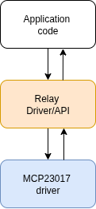

#### Scalability of the relay controls
Now, because I used an I2C expander, the MCP23017 has 3 address bits(A0,A1, A2), so it can handle up to 8 devices on the same I2C peripheral. Those are 128 relays that can be added.
Scaling the Relay control class is as "simple" adding another MCP23017 IC and hardware-configuring the address.
On the software side, the driver remains the same, but if we add more relays we need to add more banks. SHould be trivial. Rather, this was my approach.

## Testing and validation
I have tested and validated this code/functions with actual hardware expander chip and STM32F401CCU6, the following tests have been carried out:
    - STM32F401CCU6 code compilation
    - MCP23017 Driver GPIO expansion
The image below shows a crude breadbosrd model of this.

[todo -insert image]

However, for Relay control, PLC ladder logic is used for industrial setting. How I would test this is I would write PLC ladder logic code to verify ....

[todo]


# 2. MODBUS RTU

### RS485 Hardware
To include RS485 transceiver hardware interface, I used MAX485 IC and designed its typical circuit. This can be used for both master and slave, difference being the termination. 

What is included in this circuit excerpt:
- MAX485 transceiver IC
- COmmon mode choke for high frequency noise 
- TVS for transient suppression 
- Low ohm series resistors for ringing/reflection suppression
- 120R Termination resistor ON/OFF control

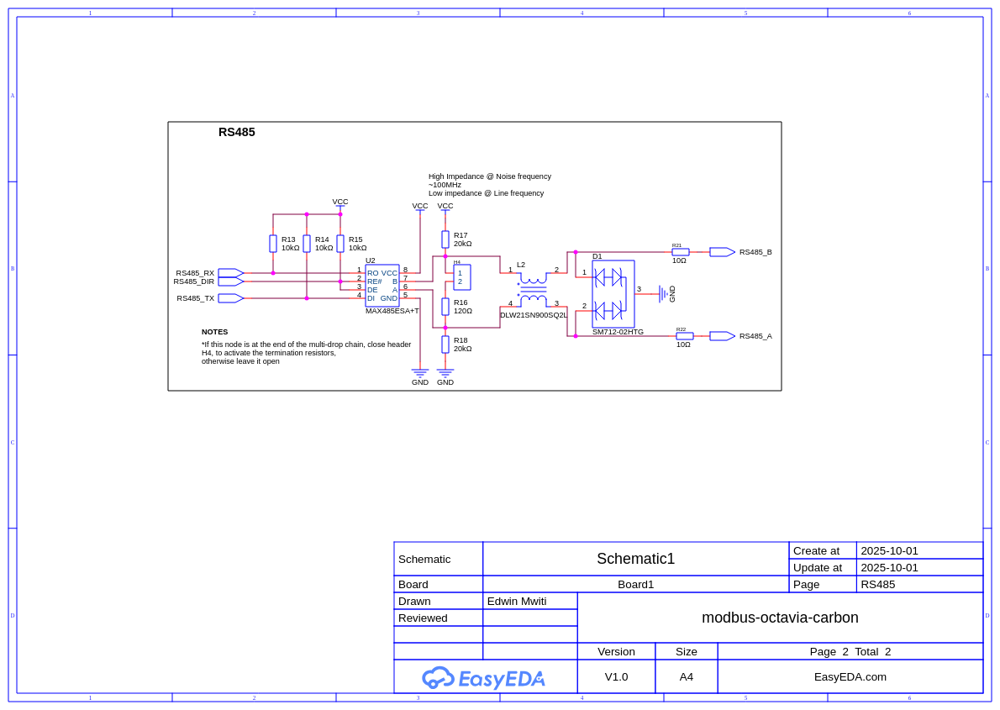

#### Improvement
Based on my experience, RS485 is a pretty robust standard and the tranceivers handle most of the noise/suppression for differential signals. However, for maximum reliability, the following can be added: 

- Add MOV for to line A and B just next to the connector so high V transients are caught fast. 
- Provide galvanic isolation between the MCU and the RX/TX/DI signals to properly isolate the MCU and other circuit components on this line.


### RS485 Driver
This section will describe how I designed for MODBUS RTU.
MODBUS consists of a slave and a master. The master sends requests to slave and the slave responds back with the requested data. The list below shows the function codes that can be used under MODBUS:

| Function Code | Hex Value | Description                          |
|---------------|-----------|--------------------------------------|
| 01            | 0x01      | Read Coils                           |
| 02            | 0x02      | Read Discrete Inputs                 |
| 03            | 0x03      | Read Holding Registers               |
| 04            | 0x04      | Read Input Registers                 |
| 05            | 0x05      | Write Single Coil                    |
| 06            | 0x06      | Write Single Register                |
| 08            | 0x08      | Diagnostics (Serial Line only)       |
| 11            | 0x0B      | Get Comm Event Counter (Serial Line only) |
| 15            | 0x0F      | Write Multiple Coils                 |
| 16            | 0x10      | Write Multiple Registers             |
| 17            | 0x11      | Report Server ID (Serial Line only)  |
| 22            | 0x16      | Mask Write Register                  |
| 23            | 0x17      | Read/Write Multiple Registers        |
| 43/14         | 0x2B/0x0E | Read Device Identification           |

The following is the generic structure of MODBUS RTU packet:

```c
[ Slave Address ][ Function Code ][ Data ][ CRC Low ][ CRC High ]

```

Therefore depending on the function code being implemented, the data section can vary.

#### 1. Read coils (0x01)

The following is the structure of a MODBUS RTU packet from the master to request for coil data.

```c
[ Slave Addr ][ 0x01 ][ Start Addr Hi ][ Start Addr Lo ][ Quantity Hi ][ Quantity Lo ][ CRC Lo ][ CRC Hi ]

```

Coils are defined as single-bit values that represent the status of a input/output value. They are boolean variables. For integration with relay control, since the relays are arranged in BANKS, a single BANK May be considered a coil byte, with each bit representing the status of a relay.


The master sends request to the slave which then interprets the request to determine which operation it should perfom (read coils, etc)

The following is the structure of the MODBUS RTU packet from the master side:

[insert MODBUS master request packet here]

This means that my device (slave) must intepret these requests and perform the requested function and then respond back to the master with the requested data.

#### Compatibility with S7-1200
The S7 is going to be the master device that pulls data from MODBUS server, in this case my device is the slace device. TO maintain compatibilty, I made sure this device achieves the following list:
- Serial setings (BAUD:115200, 8-N-1)
- Uses standard MODBUS RTU framing
- confirms the 3.5 char SILENT INTERVAL
- Responds correctly to function codes
- Handle MODBUS exceptions correctly
- Handle slave IDs correctly
- RE/DE correct control
- CRC-16 computing

#### MAX485-MODBUS driver
I wrote a basic driver to handle MODBUS data reception. This STM32 driver was to implement most if not all of the above requirements for S7-1200.
It exposes the following interface:

 - MAX485 device init
 - End of transmission silent interval using UART IDLE LINE DETECTION
 - Correctly decodes MODBUS frame from master
    - Message length decoding
    - extraction of MODBUS function code
    - extraction of MODBUS data
    - CRC calculation
- Exception handling for MODBUS
- MODBUS timeout

#### Handling unknown data length
For efficiency due to handling a large data packet, I use UART with IDLE LINE DETECTION for data reception. This allows to detect the end of transmission burst (3.5 char SILENT Interval).

Now, from the MODBUS protocol, the maximum packet size is 255 bytes.
The actual data length is 252 bytes

[todo- confirm]

The data is routed via MAX485 transceiver to handle TTL to RS485 conversion. Then my driver handles this next part which is written to parse/decode the packet:

#### MAX485 driver API
a) Driver initialization
I initialize MAX485 instance with the ```UART peripheral```, ```GPIO PORT ``` and the ```DE_RE pin```.

```c

typedef struct {
	UART_HandleTypeDef* uart_instance;
	GPIO_TypeDef* DE_RE_PORT;
	uint16_t DE_RE_pin;
} MAX485;

typedef MAX485* MAX485_instance;

```

b) Enable transmit
This function is used to set MAX485 for transmission mode

```c

/**
 * @brief This functions enables the transmit mode on MAX485 IC
 */
void MAX485_enable_transmit(MAX485_instance inst) {
	//write 1 on the DE pin
	HAL_GPIO_WritePin(inst->DE_RE_PORT, inst->DE_RE_pin, GPIO_PIN_SET);

}
```

c) Enable receive
This function is used to set MAX485 for receive mode

```c

void MAX485_enable_receive(MAX485_instance inst) {
	// write 1 on the RE pin
	HAL_GPIO_WritePin(inst->DE_RE_PORT, inst->DE_RE_pin, GPIO_PIN_RESET);
}
```

d) Send data (send response)
This function is used to send a response back to the master device

e) Calculate CRC
This function is used to calculate and confirm CRC from the received master request

f) build exception
This function is used to create a MODBUS exception code

g) read coil
This functions implements the (0x01) function code to read a single coil

h) write single coil
This function implements the (0x05) function code to write single coil

i) write multiple coils
This function implements the (0x0F) function code to write to multiple coils

## 3. Testing and Validation
Using the hardware I had namely:
- MAX485 modules
- STM32F401CCU6

I could transmit from one STM32 (MASTER ) to the slave devive. This is my breadboard setup:

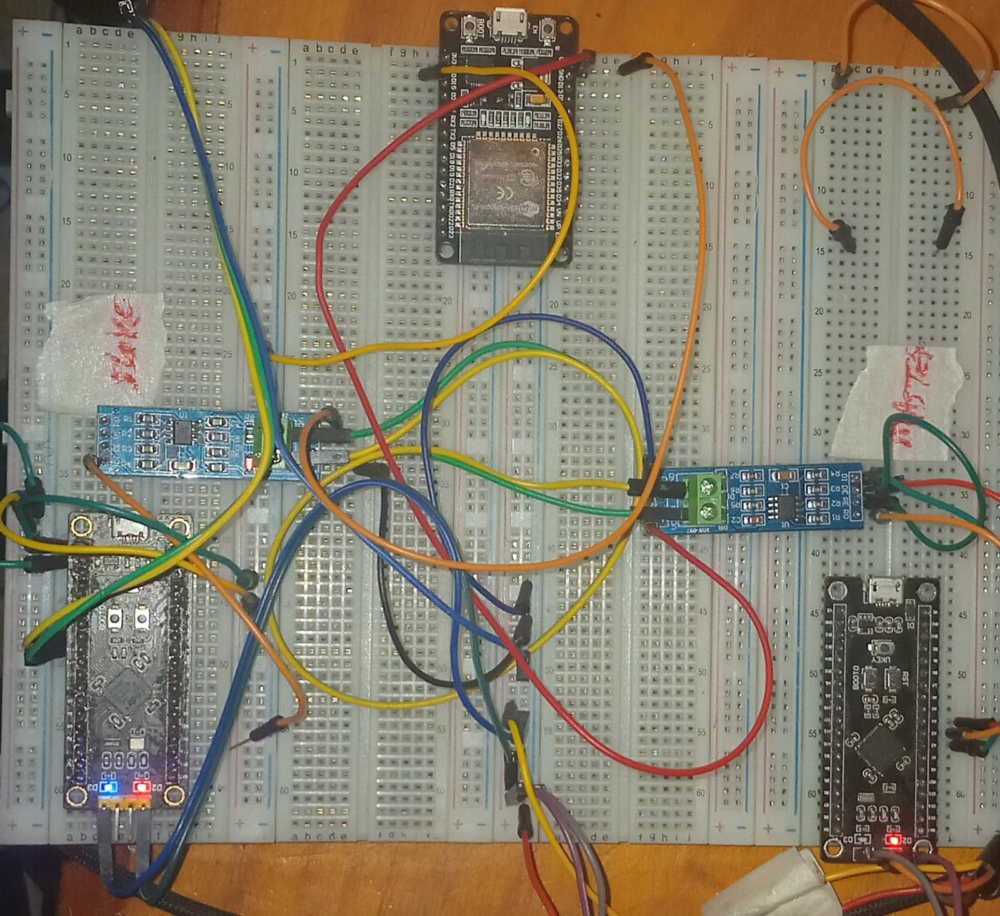 -> SMT32 MASTER-SLAVE MAX485 SETUP

However, to test real MODBUS RTU packets, I used QMODMASTER simulator on my PC to simulate the master packets. The following scrennshots show that master commands are being identified.This was the first handshake between master(My PC) and the STM32 slave device.

The following is the setup I used:

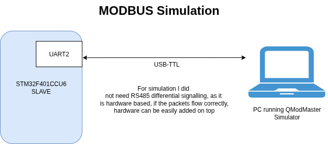

##### Read coils
---
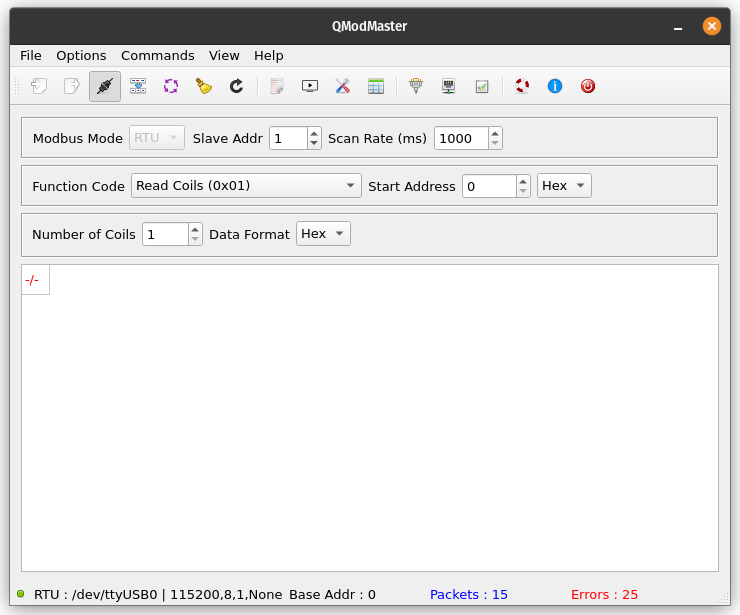 -> QMODMASTER SIMULATOR
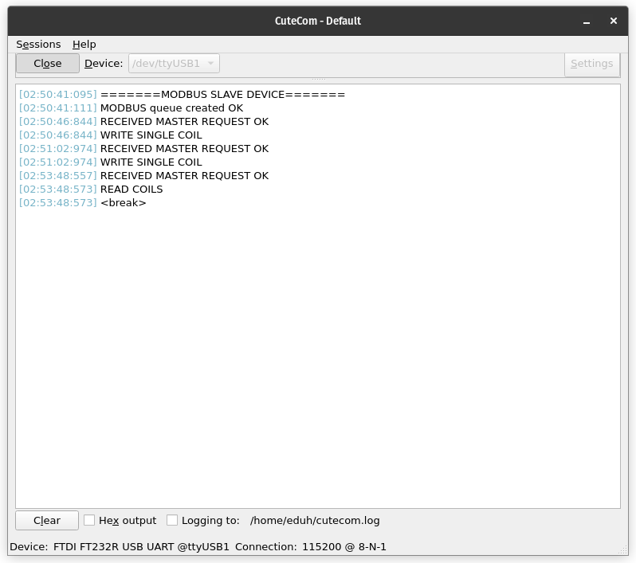 -> SERIAL OUTPUT

##### Write multiple coils
---
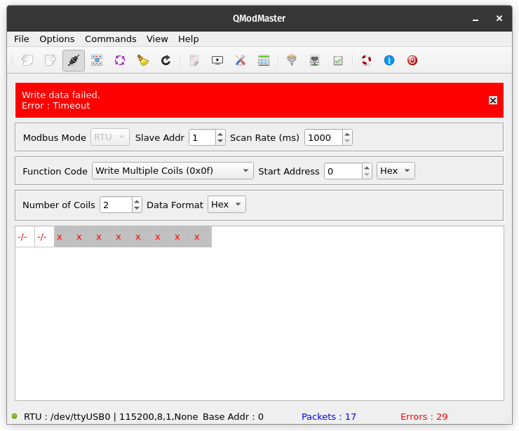 -> QMODMASTER SIMULATOR
 -> SERIAL OUTPUT

##### Write single coil
---
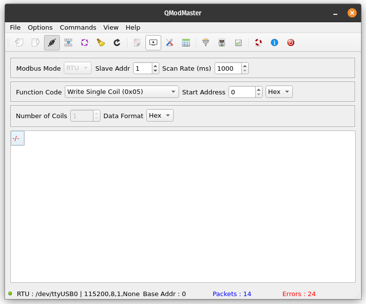 -> QMODMASTER SIMULATOR
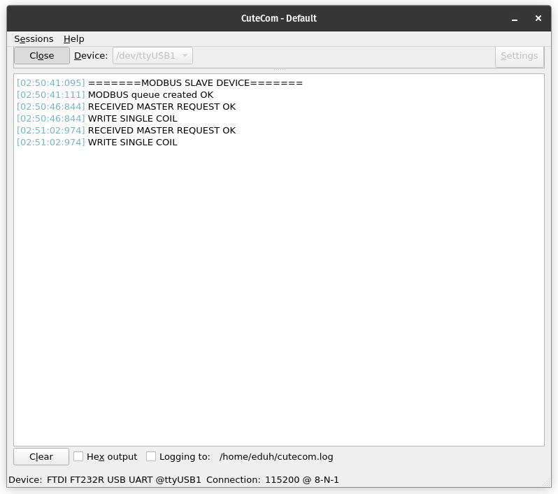 -> SERIAL OUTPUT


### SIMULATION WITH QMODMASTER
#### Read coils
I simulated the read coils function and the following was the response:

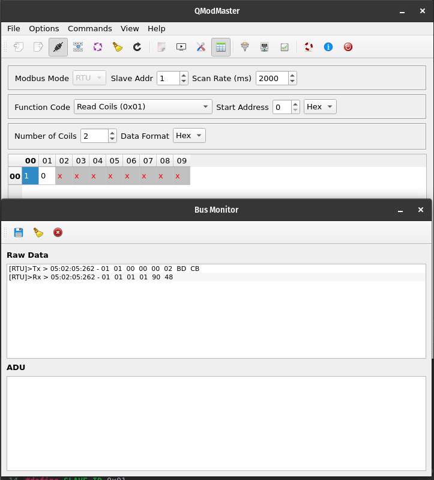

I had a dummy coil data as shown here, (ideally these should be set and reset with relays):

```c
uint8_t coils[(COIL_COUNT + 7) / 8] = {0x4D, 0x0D};
```

My read coils function is simulated correctly and the expected response was received. This demonstrates interoperability with a MODBUS simulator.


# ETHERNET CONNECTIVITY
The purpose of ethenet in this slave is to allow the slave device to communicate over an network using MODBUS TCP. This allows the MODBUS slave to be part of a local area network. 

MODBUS TCP wraps the MODBUS protocol in TCP/IP packets. The slave device listens on a TCP port( typically 502) and responds to requests from a MODBUS TCP master. 

Ethernet is therefore the physical medium that carries these TCP/IP packets.

The block diagram below explains this part:

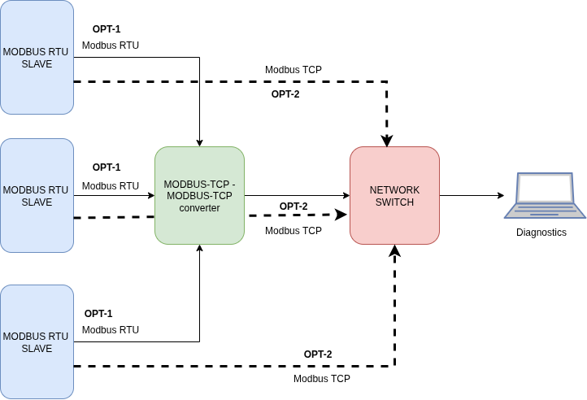

Since the slave device exposes a direct Ethernet connectino, it can be directly connected to a Network switch then routed to diagnostics tool etc. 

Additionally, a MODBUS-RTU to MODBUS-ETHERNET converter can be used to 

To add ethernet connectivity, I had to use an external PHY chip because STM32F401CCU6 does not have an internal ethernet PHY ability. The block diagram below shows the flow diagram of Ethernet in hardware.

To increase reliabilty on the ETHERNET port, I used an RJ45 connector with integrated magnetics. This does not include impedance matching as an external circuit. THey are designed to provide correct impedance (100 R differential), for ethernet, as well as suppress common mode noise.

The circuit below shows my circuit excerpt for Ethernet Functionality:


W5500 chip will be an SPI slave to the MCU controller. 


# RTOS INTEGRATION
For concurrence management, the following tasks were defined at a minimum:
    - relay control task
    - MODBUS RTU task
    - Ethernet communication task
    - System monitoring task

##### System monitoring task( x_device_get_diagnostics task)
This task is used to collect general board/device data, and monitor the system parameters.

The data that I collect is:
    - chip ID
    - Die temperature
    - core clock frequency
    - Internal supply voltages
    - Reference voltage (I read this incase ADC is used directly without external ADC converters that use I2C where internal ADC ref voltage does not matter much)
    - free heap size
    - minimum ever free heap size since started running
    - number of running tasks
    - TCB (task control block) size for each task
    - Reset cause (watchdog, software reset, brownout reset)

The inbuilt chip parameters can be enabled or disabled by setting the ```GET_INTERNAL_PARAMETERS``` to 0 in the ```custom_config.h``` file.

[add code]


### Priority table and logic behind it

#### Interrupt vector Priority
Priority must be numerically >= configLIBRARY_MAX_SYSCALL_INTERRUPT_PRIORITY (often 5).


# TESTING AND VALIDATION PLAN

### Stress test plan
TO stess this board, I would go with Uptime calculation. This is outlined below:
1. After compiling and tesing code locally. Code is uploaded to electrically tested PCBs.
2. The system start time is logged manually. Also, the system start time is logged onboard the device. The system maintains a


### Todos/feature list
1. Add function to check supported MODBUS RTU function codes
2. Add function to create MODBUS exceptions for each message received
3.


## REFERENCES
1. https://ozeki.hu/p_5876-mobdbus-function-code-1-read-coils.html
2. https://www.mesulog.fr/help/modbus/index.html?page=write-single-coil-f05.html
3. https://www.simplymodbus.ca/FC15.htm
4. https://www.freertos.org/Documentation/02-Kernel/07-Books-and-manual/01-RTOS_book
5. https://scadasploit.dev/posts/2021/07/hacking-modbus-tcp-simulation-in-linux/
6. https://www.modbustools.com/modbus.html
7. https://camatsystem.com/wp-content/uploads/2015/12/Modbus-manual-TD80.pdf
8. https://www.ti.com/lit/pdf/SLLA200
9. https://www.ti.com/lit/pdf/slla272
10. https://www.renesas.com/en/document/apn/rs-485-design-guide-application-note?srsltid=AfmBOor6p2BFd9VdtI_gGdi3hIQGQOprWQwYm5Tu_feED4Yjchga8hdf
