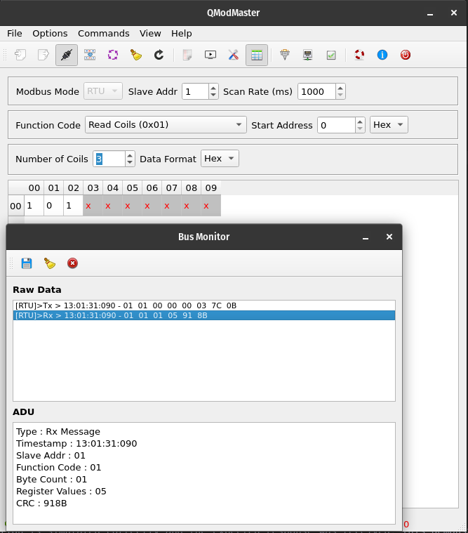
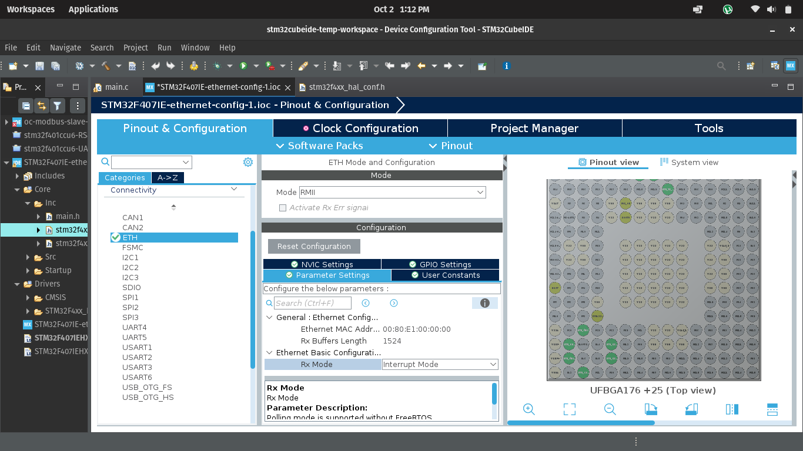
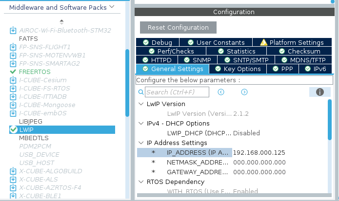
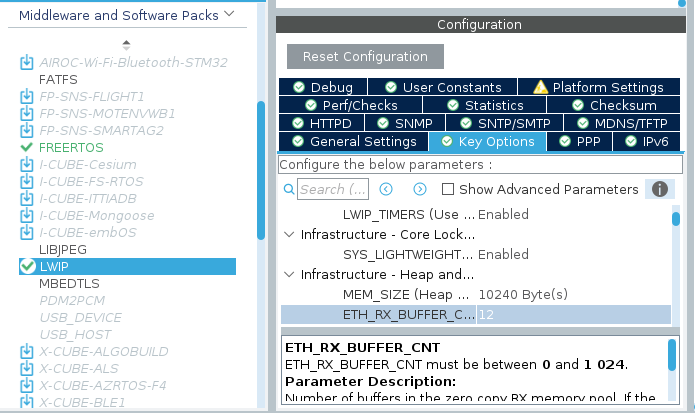
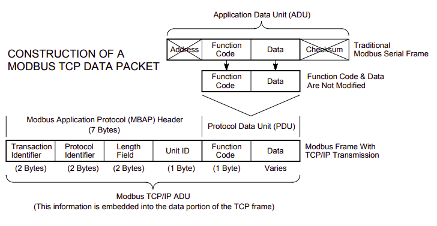

# Documentation


#### Details 
Prepared by: Edwin Mwiti
Submission for: Control and Instrumentation Engineer - Intern

## Table of Contents 
1. Introduction 
2. Functional requirements 
3. Relay control 
4. Industry standard relay control interface and schematic
5. Relay control logical organization 
6. IO expander driver 
7. Relay driver interface 
8. Relay control abstraction levels
9. Scalability of the relay controls
10. Relay Testing and validation
11. ModBuS RTU
12. RS485 transceiver schematic
13. RS485 transceiver schematic Improvement
14. RS485 Driver
15. Handling unknown ModBus data length
16. Compatibity with S7-1200
17. ModBus testing and validation with QModMaster
18. Ethernet Connectivity
19. TCP/IP control interface with ModBus TCP
20. Ethernet stack configuration
21. Concurrency management with FreeRTOS
22. Priority table and logic behind it
23. Interrupt vector Priority
24. Inter-task communication
25. Memory management strategy
26. Synchronization methods used
27. Feedback and diagnostics 
28. Fault detection mechanism 
29. Onboard fault state indicator
30. Testing and Validation plan
31. Stress Testing plan
32. Additional feature list
33. References and schemas


### Introduction
Based on the problem statement, this device is a slave device because it implements slave functions especially the MODBUS register read and write. i.e:
- Read coils
- Write single coil
- write multiple coils

Also, I figured that because it has relays, these relay are to be controlled by another device (MASTER device) via the MODBUS RTU. And this master device is the SIEMENS S7-1200.

Also this slave exposes its port/URL via ethernet. So data can be transferred, logged etc..

## Functional Requirements
# 1.Relay Control

## Industry standard relay control  hardware 
To meet the industry standard safety requirement, I made a heavy reference to IEC 60947 that defines control of high voltage switchgear (RCBs, Relays, contactors) etc. (Link in the references)

Although much of it is implemented when laying out the PCB (e.g creepage distances), here is a list of what I implemented in this relay control circuit: 
1. Isolation using optocouplers 
2. Flyback and surge suppression using flyback diodes, RC snubber and TVS clampers
5. Fault detection

This circuit is designed to be compatible with PLC-RSC-24DC/21 relay module that has the following features:
- Screw connection 
- DIN rail mount NS 35/7, 5, 1
- 1 changeover contact 
- Input voltage 24V
- Rated insulation voltage 250V
- MAX power disspation 
- Overvoltage category III


### Relay logical organization
To organize 32 relays logically, and to remain simple, I used bit groups. Each relay bank is a uint8_t type, where each relay is represented by a single bit in that uint8_t type.

|Bank name| Type| Relays range |
|---|---|---|
|BANK_0|uint8_t | Relay 0-7 |
|BANK_1|uint8_t | Relay 8-15 |
|BANK_2|uint8_t | Relay 16-23 |
|BANK_3|uint8_t | Relay 24-31 |

These are defined in ```relay.h``` file. Since there are 32 relays to be controlled, I use an expander via i2c for this function.

#### IO Expander driver
The driver I use is the MCP23017. I choose it because it has 16 bit outputs whcih means I only need 2 expanders to handle 32 relays.
I wrote a basic driver for the needed fucntions of interfacing the RELAY to the STM32. Some of these fucntions are:

```c
void MCP_initialize(MCP23017_instance inst, I2C_HandleTypeDef* i2c_handle, uint8_t address);
void MCP_pinmode(MCP23017_instance inst, uint8_t pin, uint8_t mode);
void MCP_all_pinmode(MCP23017_instance inst, uint8_t state, uint8_t port);
void MCP_write_pin(MCP23017_instance inst, uint8_t pin, uint8_t level);
uint8_t MCP_read_pin(MCP23017_instance inst, uint8_t pin);
uint8_t MCP_read_port(MCP23017_instance inst, uint8_t port_num);
void MCP_clear_port(MCP23017_instance inst, uint8_t port_num);

```

#### Relay driver API
To meet hardware abstraction and code maintainability, all relay control functions are defined in their own header file,
```c relay.h```

I have written the API to achieve the required deliverables of setting, clearing and reading the state of each relay, using logical
orgnaization in banks.

The relay API functions are listed below:
```c

void relay_init();
void relay_set(uint8_t bank, uint8_t relay_num, uint8_t state);
boolean_t relay_read_state();
uint8_t relay_resolve_bank(uint8_t n);

uint8_t relay_read(uint8_t bank, uint8_t relay_num);
uint8_t relay_read_bank(uint8_t bank);

void relay_clear(uint8_t bank, uint8_t relay_num);
void relay_clear_bank(uint8_t bank);


```
The fucntions are pretty quite well documented on the files themselves.


#### Abstraction levels
To meet hardware abstraction, the MCP23017 is only visible through the relay driver APIs, since that is the only user. This diagram shows the abstraction:


#### Scalability of the relay controls
Now, because I used an I2C expander, the MCP23017 has 3 address bits(A0,A1, A2), so it can handle up to 8 devices on the same I2C peripheral. Those are 128 relays that can be added.
Scaling the Relay control class is as "simple" adding another MCP23017 IC and hardware-configuring the address.
On the software side, the driver remains the same, but if we add more relays we need to add more banks. SHould be trivial. Rather, this was my approach.

## Testing and validation
I have tested and validated this code/functions with actual hardware expander chip and STM32F401CCU6, the following tests have been carried out:
    - STM32F401CCU6 code compilation
    - MCP23017 Driver GPIO expansion
The image below shows a crude breadbosrd model of this.

[todo -insert image]

However, for Relay control, PLC ladder logic is used for industrial setting. How I would test this is I would write PLC ladder logic code to verify ....

[todo]


# 2. MODBUS RTU

### RS485 transceiver schematic
To include RS485 transceiver hardware interface, I used MAX485 IC and designed its typical circuit. This can be used for both master and slave, difference being the termination. 

What is included in this circuit excerpt:
- MAX485 transceiver IC
- COmmon mode choke for high frequency noise 
- TVS for transient suppression 
- Low ohm series resistors for ringing/reflection suppression
- 120R Termination resistor ON/OFF control


#### RS485 transceiver schematic Improvement
Based on my experience, RS485 is a pretty robust standard and the tranceivers handle most of the noise/suppression for differential signals. However, for maximum reliability, the following can be added: 

- Add MOV for to line A and B just next to the connector so high V transients are caught fast. 
- Provide galvanic isolation between the MCU and the RX/TX/DI signals to properly isolate the MCU and other circuit components on this line.


### RS485 Driver
This section will describe how I designed for MODBUS RTU.
MODBUS consists of a slave and a master. The master sends requests to slave and the slave responds back with the requested data. The list below shows the function codes that can be used under MODBUS:

| Function Code | Hex Value | Description                          |
|---------------|-----------|--------------------------------------|
| 01            | 0x01      | Read Coils                           |
| 02            | 0x02      | Read Discrete Inputs                 |
| 03            | 0x03      | Read Holding Registers               |
| 04            | 0x04      | Read Input Registers                 |
| 05            | 0x05      | Write Single Coil                    |
| 06            | 0x06      | Write Single Register                |
| 08            | 0x08      | Diagnostics (Serial Line only)       |
| 11            | 0x0B      | Get Comm Event Counter (Serial Line only) |
| 15            | 0x0F      | Write Multiple Coils                 |
| 16            | 0x10      | Write Multiple Registers             |
| 17            | 0x11      | Report Server ID (Serial Line only)  |
| 22            | 0x16      | Mask Write Register                  |
| 23            | 0x17      | Read/Write Multiple Registers        |
| 43/14         | 0x2B/0x0E | Read Device Identification           |

The following is the generic structure of MODBUS RTU packet:

```c
[ Slave Address ][ Function Code ][ Data ][ CRC Low ][ CRC High ]

```

Therefore depending on the function code being implemented, the data section can vary.
I wrote a basic driver to handle MODBUS data reception. This STM32 driver was to implement most if not all of the above requirements for S7-1200.

It exposes the following interface:

 - MAX485 device init
 - End of transmission silent interval using UART IDLE LINE DETECTION
 - Correctly decodes MODBUS frame from master
    - Message length decoding
    - extraction of MODBUS function code
    - extraction of MODBUS data
    - CRC calculation
- Exception handling for MODBUS
- MODBUS timeout

#### Handling unknown ModBus data length
For efficiency due to handling a large data packet, I use UART with IDLE LINE DETECTION for data reception. This allows to detect the end of transmission burst (3.5 char SILENT Interval).

Now, from the MODBUS protocol, the maximum packet size is 255 bytes.
The actual data length is 252 bytes

[todo- confirm]

The data is routed via MAX485 transceiver to handle TTL to RS485 conversion. Then my driver handles this next part which is written to parse/decode the packet:

#### RS485 driver API
a) Driver initialization
I initialize MAX485 instance with the ```UART peripheral```, ```GPIO PORT ``` and the ```DE_RE pin```.

```c

typedef struct {
	UART_HandleTypeDef* uart_instance;
	GPIO_TypeDef* DE_RE_PORT;
	uint16_t DE_RE_pin;
} MAX485;

typedef MAX485* MAX485_instance;

```

b) Enable transmit
This function is used to set MAX485 for transmission mode

```c

/**
 * @brief This functions enables the transmit mode on MAX485 IC
 */
void MAX485_enable_transmit(MAX485_instance inst) {
	//write 1 on the DE pin
	HAL_GPIO_WritePin(inst->DE_RE_PORT, inst->DE_RE_pin, GPIO_PIN_SET);

}
```

c) Enable receive
This function is used to set MAX485 for receive mode

```c

void MAX485_enable_receive(MAX485_instance inst) {
	// write 1 on the RE pin
	HAL_GPIO_WritePin(inst->DE_RE_PORT, inst->DE_RE_pin, GPIO_PIN_RESET);
}
```

d) Send data (send response)
This function is used to send a response back to the master device

e) Calculate CRC
This function is used to calculate and confirm CRC from the received master request

f) build exception
This function is used to create a MODBUS exception code

g) read coil
This functions implements the (0x01) function code to read a single coil
The following is the structure of a MODBUS RTU packet from the master to request for coil data.

```c
[ Slave Addr ][ 0x01 ][ Start Addr Hi ][ Start Addr Lo ][ Quantity Hi ][ Quantity Lo ][ CRC Lo ][ CRC Hi ]

```

Coils are defined as single-bit values that represent the status of a input/output value. They are boolean variables. For integration with relay control, since the relays are arranged in BANKS, a single BANK May be considered a coil byte, with each bit representing the status of a relay.

The master sends request to the slave which then interprets the request to determine which operation it should perfom (read coils, etc)

The following is the structure of the MODBUS RTU packet from the master side:

[insert MODBUS master request packet here]

This means that my device (slave) must intepret these requests and perform the requested function and then respond back to the master with the requested data.

h) write single coil
This function implements the (0x05) function code to write single coil

i) write multiple coils
This function implements the (0x0F) function code to write to multiple coils

## Compatibility with S7-1200
The S7 is going to be the master device that pulls data from MODBUS server, in this case my device is the slace device. TO maintain compatibilty, I made sure this device achieves the following list:
- Serial setings (BAUD:115200, 8-N-1)
- Uses standard MODBUS RTU framing
- confirms the 3.5 char SILENT INTERVAL
- Responds correctly to function codes
- Handle MODBUS exceptions correctly
- Handle slave IDs correctly
- RE/DE correct control
- CRC-16 computing

## ModBus Testing and Validation with QModMaster
Using the hardware I had namely:
- MAX485 modules
- STM32F401CCU6

I could transmit from one STM32 (MASTER ) to the slave device. 

However, to test real MODBUS RTU packets, I used QmodMaster simulator on my PC to simulate the master packets. The following screenshots show that master commands are being identified.

The following is the setup I used:


### Read coils
---

I used a simulated coil byte array that looks like this:

```c
/* example coils byte array for testing - each bit holds a coil - grouped into bytes of coils */
uint8_t coils[(COIL_COUNT + 7) / 8] = {0x4D, 0x0D};
```
I will try read from the first byte (0x4D) (0b01001101) to validate my code. 
This is the request sent from the master: 

#### Request (from Master)
| Field        | Value (Hex) | Description                     |
|--------------|-------------|---------------------------------|
| Slave ID     | `01`        | Address of slave device         |
| Function     | `01`        | Read Coils                      |
| Start Addr Hi| `00`        | High byte of start address      |
| Start Addr Lo| `00`        | Low byte of start address       |
| Qty Hi       | `00`        | High byte of quantity           |
| Qty Lo       | `03`        | Read 3 coils                    |
| CRC Lo       | `??`        | CRC16 low byte (calculated)     |
| CRC Hi       | `??`        | CRC16 high byte (calculated)    |

#### Expected response 
Since my coils bits are 0b0100 1101, and first coil is LSB, I expect to return 0b0000 0101 (0x05) as the value of my coils. This is the expected response: 

#### Response (from Slave, coils = `0x4D`)
| Field        | Value (Hex) | Description                          |
|--------------|-------------|--------------------------------------|
| Slave ID     | `01`        | Same as request                      |
| Function     | `01`        | Read Coils                           |
| Byte Count   | `01`        | 1 byte of coil data follows          |
| Coil Status  | `05`        | `0b00000101` → coils 0=1, 1=0, 2=1    |
| CRC Lo       | `??`        | CRC16 low byte (calculated)          |
| CRC Hi       | `??`        | CRC16 high byte (calculated)         |

I did this using the simulator and this is the response

 

This validates my read coils function as required.

##### Write multiple coils
---
 -> QMODMASTER SIMULATOR
 -> SERIAL OUTPUT

##### Write single coil
---
 -> QMODMASTER SIMULATOR
 -> SERIAL OUTPUT


#### Read coils
I simulated the read coils function and the following was the response:


I had a dummy coil data as shown here, (ideally these should be set and reset with relays):

```c
uint8_t coils[(COIL_COUNT + 7) / 8] = {0x4D, 0x0D};
```

My read coils function is simulated correctly and the expected response was received. This demonstrates interoperability with a MODBUS simulator.


# Ethernet Connectivity
The purpose of ethernet in this slave is to allow the slave device to communicate over an network using MODBUS TCP. This allows the MODBUS slave to be part of a local area network. 

MODBUS TCP wraps the MODBUS protocol in TCP/IP packets. The slave device listens on a TCP port( typically 502) and responds to requests from a MODBUS TCP master. 

Ethernet is majorly part of data link layer but also the physical layer in the OSI Model that carries these TCP/IP packets.

## Ethernet stack configuration
Two components are of importance here: 
- MAC layer (Media access controller)
- PHY layer

MAC handles the data link layer such as framing, addressing and managing ethernet packets.

PHY is an external chip connected to STM32 via RMII or MII interface. I used the popular W5500 PHY chip for this project. It manages the actual electrical signaling, speed negotiation and link detection with the ethernet cable.

MAC and PHY form the complete ethernet interface. Since the MAC is inside the STM32, STM32 is responsible for setting up the MAC interface and configuring pins while PHY handles the physical connectivity to the network. 

The block diagram below explains this part:


Since the slave device exposes a direct Ethernet connection, it can be directly connected to a Network switch then routed to diagnostics tool etc. 

Additionally, a MODBUS-RTU to MODBUS-ETHERNET converter can be used to mate MOodBus RTU packets to ModBus TCP packets for use in the diagnostics tool.

## Ethernet connectivity on STM32
Since STM32F401CCU6 does not have internal MAC, I switched to STM32F407IEH6 which has internal MAC. This is purely to demonstrate ethernet setup. 

```c
Note: This ethernet setup and code is untested, I will admit that at this point because I do not have live testing of this ethernet section as I build, it is hard to remain accurate with 100% confidence. However, it should work with minimal modification and/or porting.

```

The steps below show this setup: 

1. Setting up the RMII interface
I use the RMII interface for interfacing MAC and ethernet PHY chip. 



2. The STM32 Board does not allow confiiguring of memory addresses so I skipped this part 
3. RX buffer length was set to 1524 bytes, default setting. 
4. The memory is allocated in the SRAM region
5. MAC address was set to 00:80:E1:00:00:00

### LwIP setup 
I leveraged the Lightweight IP middleware to setup IP functionality. LwIP provides reduced-resource-usage IP protocols for use in embedded systems. LwIP is available as a middleware in the STM32 stack: 

Settings used  to bring LwIp up are as follows: 
1. DHCP is disabled so that I can assign a static IP address to my device. The IP address was set to 192.168.0.125

2. Heap memory is allocated to 10KB(10240 Bytes) . If the application will send a lot of data that needs to be copied, this should be set high



3. After this I generated the code.

### Ping Test 


### Ethernet schematic excerpt 
To increase reliabilty on the ETHERNET port, I used an RJ45 connector with integrated magnetics. This does not include impedance matching as an external circuit. THey are designed to provide correct impedance (100 R differential), for ethernet, as well as suppress common mode noise.

The circuit below shows my circuit excerpt for Ethernet Functionality:


W5500 chip will be an SPI slave to the MCU controller. 

## TCP/IP control interface with ModBus TCP
The only difference between ModBus RTU and ModBus TCP is that ModBus TCP embeds the standard ModBus frame packet into a TCP frame that looks like the one below: 




My approach to implement the interface to handle ModBus TCP is as follows: 
1. Receive ModBus packet via ethernet on port 502
2. Trigger the tcp_receive_callback().
3. pass payload to ```x_task_modbus_receive_TCP```
4. process request -> extract function code length etc...
5. build a reply 
6. send back reply via ```modbus_TCP_send_response()```


# Concurrency management with FreeRTOS
For concurrence management, the following tasks were defined at a minimum:
    - relay control task
    - MODBUS RTU task
    - Ethernet communication task
    - System monitoring task

## Task 1: System monitoring task( x_device_get_diagnostics task)
This task is used to collect general board/device data, and monitor the system parameters.

The data that I collect is:
    - chip ID
    - Die temperature
    - core clock frequency
    - Internal supply voltages
    - Reference voltage (I read this incase ADC is used directly without external ADC converters that use I2C where internal ADC ref voltage does not matter much)
    - free heap size
    - minimum ever free heap size since started running
    - number of running tasks
    - TCB (task control block) size for each task
    - Reset cause (watchdog, software reset, brownout reset)

The inbuilt chip parameters can be enabled or disabled by setting the ```GET_INTERNAL_PARAMETERS``` to 0 in the ```custom_config.h``` file.

[add code]

## Task 2: ModBus RTU task
The code snippet below shows the MODBUS RTU task. 

## Task 3: Modbus TCP task


## Task 3: Ethernet communication task 

## Task 4: System monitoring task

### Priority table and logic behind it

#### Interrupt vector Priority
Priority must be numerically >= configLIBRARY_MAX_SYSCALL_INTERRUPT_PRIORITY (often 5).

### Inter-task communication
To handle inter-task communication, I mainly used shared queues. For instance for diagnostics task, I created a queue with 5 items that hold a diagnostics data type as shown below: 

This queue is used in the following two tasks:
1. Debug to terminal task
2. Send via ethernet task. 

### Synchronization methods used 
One of the typical problems when using shared queues for intertask communication is that you must manage the producers and consumers effectively, otherwise the consuming tasks will see different data points which is not desired. This is due to the fact that when you receive data on a consumer task using ``` xQueueReceive()```, that data point is removed from the queue, so if there is another task receiving this same data, it will receive the next data point, which is a problem.

So I used Event Groups to syncronize the data passing. Event groups allow me to wait until all the tasks have received the data, then I can effectively remove the data from the queue.  

I defined this event group as follows: 
```c
EventGroupHandle_t modbus_event_group_handle;
```
Now, I figured how many producers and consumers I have for my modbus data. This block diagram shows this: 


Then I define a bit mask for each consumer task 

```c
// ============ EVENT GROUPS =================
#define RECEIVE_MODBUS_BIT		(1 << 0UL)		// bit set if MODBUS RTU received from MODBUS_RTU queue
#define PRINT_TO_TERMINAL_BIT	(1 << 1UL)		// bit set if Print to terminal task received from MODBUS_RTU queque
```


Each task is responsible for only peeking into the queue, without removing data from the queue. After this, is sets the corresponding event bit to notify the event group that it has finished using the data. 

The task named ```x_task_clean_modbus_RTU_queue``` sits waiting for all the consumer tasks that depend on ModBus RTU data to finish receiving the data. After checking all bits are set, it can then effectivley remove this data from queue. 
By doing this, I am able to basically sync producing tasks and consuming tasks.


### Memory management strategy

### Feedback and diagnostics 

### Fault detection mechanism 

### Onboard fault state indicator


# Testing and Validation plan

### Stress test plan
To stess this board, I would go with Uptime calculation. This is outlined below:
1. After compiling and tesing code locally. Code is uploaded to electrically tested PCBs.
2. The system start time is logged manually. Also, the system start time is logged onboard the device. The system maintains a


### Todos/feature list
1. Add function to check supported MODBUS RTU function codes
2. Add function to create MODBUS exceptions for each message received
3.


## REFERENCES
1. https://ozeki.hu/p_5876-mobdbus-function-code-1-read-coils.html
2. https://www.mesulog.fr/help/modbus/index.html?page=write-single-coil-f05.html
3. https://www.simplymodbus.ca/FC15.htm
4. https://www.freertos.org/Documentation/02-Kernel/07-Books-and-manual/01-RTOS_book
5. https://scadasploit.dev/posts/2021/07/hacking-modbus-tcp-simulation-in-linux/
6. https://www.modbustools.com/modbus.html
7. https://camatsystem.com/wp-content/uploads/2015/12/Modbus-manual-TD80.pdf
8. https://www.ti.com/lit/pdf/SLLA200
9. https://www.ti.com/lit/pdf/slla272
10. https://www.renesas.com/en/document/apn/rs-485-design-guide-application-note?srsltid=AfmBOor6p2BFd9VdtI_gGdi3hIQGQOprWQwYm5Tu_feED4Yjchga8hdf
11. https://law.resource.org/pub/in/bis/S05/is.iec.60947.1.2007.pdf
12. https://www.phoenixcontact.com/en-pc/products/relay-module-plc-rsc-24dc-21-2966171
13. https://controllerstech.com/stm32-ethernet-hardware-cubemx-lwip-ping
14. https://www.prosoft-technology.com/kb/assets/intro_modbustcp.pdf